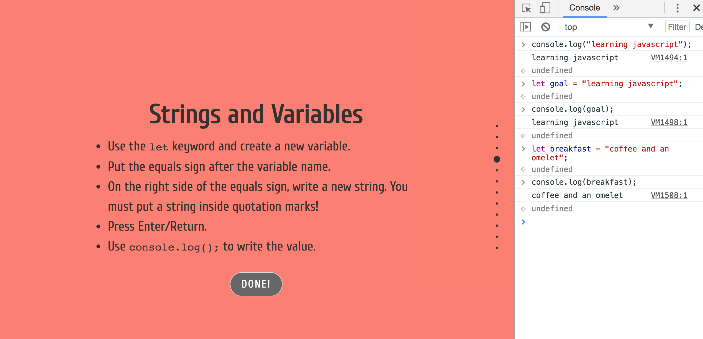

# The JS Project

This project was my excuse to try [FullPageJS](https://alvarotrigo.com/fullPage/), a five-year-old (2013) jQuery library that is still actively maintained and pretty damned sweet.

I haven't used all the options, but it was easy to figure out based on the code in the repo, the website and the demo page. It seems to be entirely bulletproof.

I got a palette for the pages from [Every ColorBrewer Scale](https://bl.ocks.org/mbostock/5577023), by Mike Bostock.

The hinge/hide animation effect was adapted from [this fiddle](http://jsfiddle.net/TFfGL/117/).

The idea was to offer a mild and simple intro to exploring JavaScript in the console. I teach students for whom JavaScript is their first-ever programming language, and it's a little hard to get them to really play around in the console. This comes back to bite them later because their understanding of the most basic basics is faulty or weak.

So I thought if I could get them to open the console side-by-side with some targeted instructions, it might encourage them to spend more time playing and getting to know how code works at the basic level.

Of course I want to get students putting JavaScript *together with HTML* as soon as possible, but I feel strongly that learning about **variables, operators, Booleans,** and **arrays** is better done in the console, interactively and with low stakes as far as errors are concerned.
